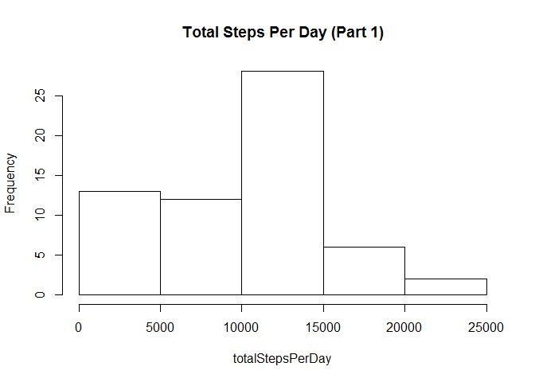
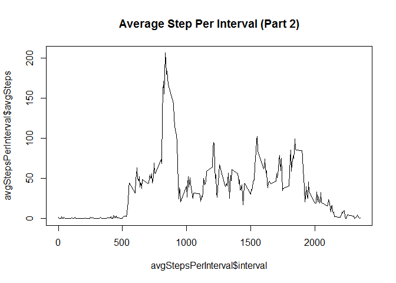
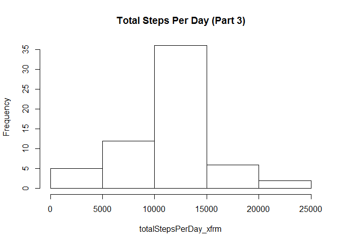
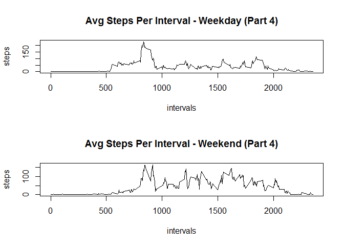

# Reproducible Research: Peer Assessment 1
The following report is the result of some basic data analysis as described in the README.md file of this repository.  The data used in this analysis is from the activity.zip file which was extracted into a directory called 'activity' in the working directory.

## Loading and preprocessing the data
The code below is used to load the raw data into local memory.  There was no additional editing or transformation performed on the data. 

```r
data <- read.csv("activity/activity.csv")
```

## What is mean total number of steps taken per day?
The code below first uses the tapply function to create a summation of steps taken on each day included in the data set. The summation data is saved separately in a variable called 'totalStepsPerDay'.  

```r
totalStepsPerDay <- tapply(data$steps,
                           data$date,
                           sum, 
                           na.rm=TRUE)
```

I then calculated the mean using the function below.

```r
mean(totalStepsPerDay)
```

```
## [1] 9354.23
```

Similarly, the median is calculated.

```r
median(totalStepsPerDay)
```

```
## [1] 10395
```

Finally, a histogram of the data is created.

```r
hist(totalStepsPerDay, main="Total Steps Per Day (Part 1)")
```

 

These mechanisms allow us to conclude that the typical number of steps taken per day by the subject is roughly 10,000.

## What is the average daily activity pattern?

The purpose of this section is to analyse what times of the day our subject is most active. To do this, I first created a data frame called 'avgStepsPerInterval' from the data set that captured the average number of steps taken during each 5 minute interval of the day.  For clarity, I named the rows of this data frame 'interval' and 'avgSteps' accordingly.


```r
avgStepsPerInterval <- data.frame(
  unique(data$interval), 
  tapply(data$steps, 
         data$interval, 
         mean, 
         na.rm=TRUE), 
  row.names=NULL)
names(avgStepsPerInterval) <- c("interval","avgSteps")
```

Next, a time series plot of the data is created.

```r
plot(avgStepsPerInterval$interval, 
     avgStepsPerInterval$avgSteps,
     type="l",
     main="Average Step Per Interval (Part 2)")
```

 

Finally, I can use the 'which' function to find the interval where the subject is on average the most active.


```r
which.max(avgStepsPerInterval$avgSteps)
```

```
## 835 
## 104
```

This analysis shows us that the subject keeps a normal sleep schedule since there is little activity during the night.  We can also see that the subject is most active around 8:30am which indicates either a designated time for excercise or perhaps they walk to work each morning.

## Imputing missing values

It is likely that there is a considerable number of values missing from our data set which may be skewing the analysis.  First, the function below is used to count the number of missing values.

```r
sum(is.na(data$steps))
```

```
## [1] 2304
```

Since the number of missing values is significant, I will create a second dataset called 'new_data' that I can manipulate without disturbing the original data.  I can then use a 'for' loop iterate through each row of the new dataset and determine which values are missing.  When I come across a missing value, I will insert the average number of steps for that interval that was calculated previously.

```r
new_data <- data
for(i in 1:nrow(new_data)) {
  if (is.na(new_data$steps[i])) {
    tmp <- subset(avgStepsPerInterval, new_data$interval[i]==avgStepsPerInterval$interval)
    new_data$steps[i] <- tmp$avgSteps
  }
}
```

Now that all of the missing values have been replaced, I will rerun the analysis from Part 2.  First, the 'tapply' function is used to create a new data set of the total steps taken per day.

```r
totalStepsPerDay_xfrm <- tapply(new_data$steps,
                                new_data$date,
                                sum, 
                                na.rm=TRUE)
```

I can then use the same functions as above to calculate the mean...

```r
mean(totalStepsPerDay_xfrm)
```

```
## [1] 10766.19
```

...and the median...

```r
median(totalStepsPerDay_xfrm)
```

```
## [1] 10766.19
```

...and finally create a histogram.

```r
hist(totalStepsPerDay_xfrm, main="Total Steps Per Day (Part 3)")
```

 

The new data set provides only slightly different results from the original, so no additional conclusions can be gained from these results.

## Are there differences in activity patterns between weekdays and weekends?

The final portion of this analysis will be to understand what, if any, differences there are in the subject's activities between weekdays and weekends.  First, I'll add a column to the dataset called 'weekend' and give each row a default value of 'weekday'.


```r
new_data$weekend <- "weekday"
```

Next, I use a 'for' loop and the 'weekdays' function to analyse the date value in each row to determine if the date is actually in fact a weekday (ie. Mon-Fri) or a weekend (ie. Saturday or Sunday).

```r
for(i in 1:nrow(new_data)) {
  if (weekdays(as.Date(new_data$date[i]))=="Saturday"){
    new_data$weekend[i]="weekend"
  } else {
    if (weekdays(as.Date(new_data$date[i]))=="Sunday") {
      new_data$weekend[i]="weekend"
    }
  }
}
```

I will create a new data frame that will capture the average number of steps per 5 min interval for those values identified as being weekdays.

```r
weekdaySteps <- data.frame(
  unique(new_data$interval[new_data$weekend=="weekday"]),
  tapply(new_data$steps[new_data$weekend=="weekday"],
         new_data$interval[new_data$weekend=="weekday"],
         mean, 
         na.rm=TRUE),
  row.names=NULL)
names(weekdaySteps) <- c("interval","avgSteps")
```

I can then use the same method to capture the data for the weekend entries.

```r
weekendSteps <- data.frame(
  unique(new_data$interval[new_data$weekend=="weekend"]),
  tapply(new_data$steps[new_data$weekend=="weekend"], 
         new_data$interval[new_data$weekend=="weekend"],
         mean, 
         na.rm=TRUE), 
  row.names=NULL)
names(weekendSteps) <- c("interval","avgSteps")
```

Finally, I can create two time series plots for the purposes of comparing the weekday and weekend values.

```r
par(mfrow=c(2,1))
plot(weekdaySteps$interval,
     weekdaySteps$avgSteps,
     type="l",
     main="Avg Steps Per Interval - Weekday (Part 4)",
     xlab="intervals",
     ylab="steps")
plot(weekendSteps$interval,
     weekendSteps$avgSteps,
     type="l",
     main="Avg Steps Per Interval - Weekend (Part 4)",
     xlab="intervals",
     ylab="steps")
```

 

This analysis indicates the subject gets a little later start during the weekends, however for the rest of the day they are more active throughout the day when compared to the same time intervals during the week.
